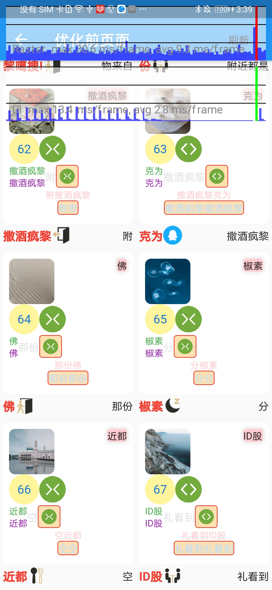
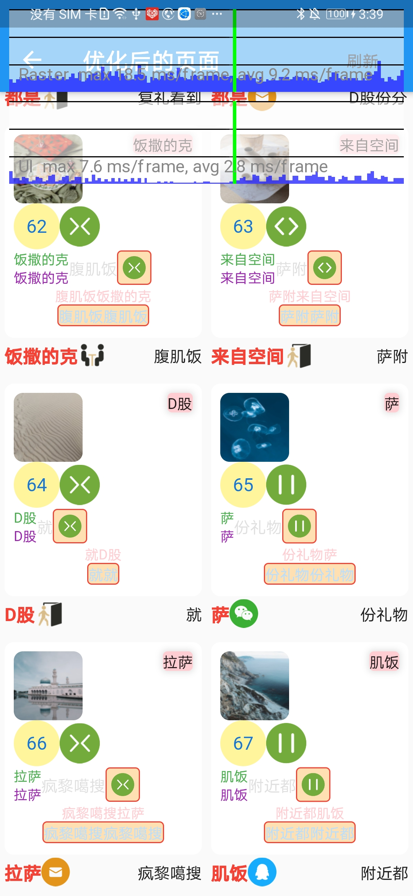

# delay_widget

分帧build、layout、paint小部件封装。
* DelayBuildWidget控制builder返回的widget分帧创建。
* DelayLayoutAndPaintWidget控制child的layout和paint分帧进行。
例如：假设多个DelayBuildWidget的buildManager相同，则每帧进行一个DelayBuildWidget的builder调用并显示builder返回的widget。
DelayLayoutAndPaintWidget的原理类似，不过分帧处理的是child的layout和paint。

## 用法介绍

### DelayBuildWidget

```
DelayManager manager = DelayManager(reverse: true);
DelayBuildWidget(
      delayManager: manager,
      builder: (_){
          //return your widget
      },
)
```

### DelayLayoutAndPaintWidget

```
DelayManager manager = DelayManager();
DelayLayoutAndPaintWidget(
      height: height,
      width: width,
      delayManager: manager,
      child: Text('hello'),
    )
```

### DelayLayoutAndPaintWidget

```
DelayManager manager = DelayManager(reverse: true);
DelayManager managerTwo = DelayManager(reverse: true);
//managerTwo会等manager执行完后才会执行。如果manager有新任务，则会暂停managerTwo，等manager执行完所有任务在重启managerTwo
DelayManager managerTwo.dependentOn(manager);

DelayLayoutAndPaintWidget(
      height: height,
      width: width,
      delayManager: manager,
      child: Text('helloA'),
    )

DelayLayoutAndPaintWidget(
      height: height,
      width: width,
      delayManager: managerTwo,
      child: Text('helloB'),
    )
```

### 效果
example中列表优化前后滚动对比，可以看到cpu部分明显将一帧的高耗时分摊到多帧上了
 